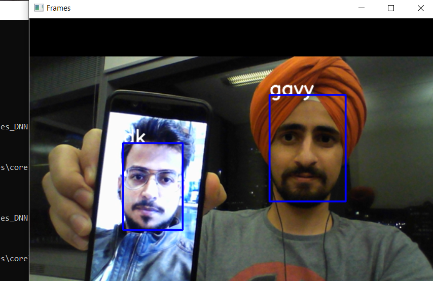

# Realtime_FaceRecognition
Real time face recognition system using Python, OpenCV and Keras

After having completed the Specialization course by Deeplearning.ai, I wanted to build a few applications on my own to understand the working of DNN models better. Since the course provided us with pretrained models and we had prebuilt utilities for most of the functions.

One such application was face recognition using ONE SHOT LEARNING.
I have been working on building a face detection system, currently training the network using MegaFace Dataset http://megaface.cs.washington.edu/dataset/download.html

The modules uploaded here are from my first attempt to build Face recognition system using simple classifier.

Here is a list of all the papers, refered during the project:

1. https://arxiv.org/abs/1503.03832 (FaceNet: giving an explanation of Triplet loss, used to train the Network and provides by far the best face detection and alliging module to crop the faces precisely)
code for this can be found at : https://github.com/davidsandberg/facenet/tree/master/src
2. https://research.fb.com/publications/deepface-closing-the-gap-to-human-level-performance-in-face-verification/
3. https://www.cs.cmu.edu/~rsalakhu/papers/oneshot1.pdf (Saimese Network)
4. http://jmlr.csail.mit.edu/papers/volume10/weinberger09a/weinberger09a.pdf (KNN)

The results of the simple face_DNN code is below(PS it used very basic classification): 

